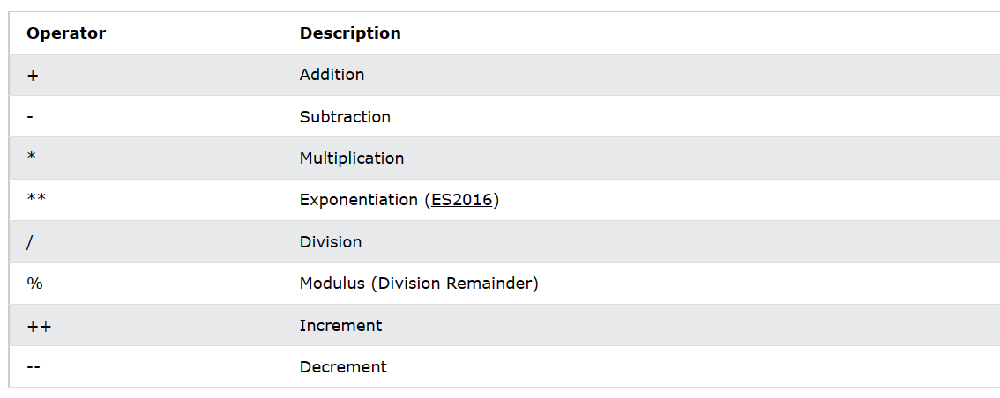

#### JavaScript — самый популярный в мире язык программирования.
#### JavaScript — это язык программирования для Интернета.


# Зачем изучать JavaScript?
##### _JavaScript_ — один из трех языков, которые должны выучить все веб-разработчики 


  > ```1. HTML для определения содержимого веб-страниц```

   > . ```CSS для указания макета веб-страниц```

   > ```3. JavaScript для программирования поведения веб-страниц```


# Введение в JavaScript
#### может изменить HTML-контент
> document.getElementById("demo").innerHTML = "Hello JavaScript";

#### JavaScript может изменять значения атрибутов HTML
> JavaScript изменяет значение srcатрибута (source) тега:
#### JavaScript может изменять стили HTML (CSS)
> document.getElementById("demo").style.fontSize = "35px

#### JavaScript может скрывать HTML-элементы
###### Скрыть элементы HTML можно, изменив displayстиль:
> document.getElementById("demo").style.display = "none";

#### JavaScript может отображать HTML-элементы
###### Отображение скрытых элементов HTML также можно выполнить, изменив displayстиль

> document.getElementById("demo").style.display = "block";

 ### Вы знали? 
* JavaScript и Java — совершенно разные языки, как по концепции, так и по дизайну.

* JavaScript был изобретен Бренданом Эйхом в 1995 году и стал стандартом ECMA в 1997 году.

* ECMA-262 — официальное название стандарта. ECMAScript — официальное название языка.

# Возможности отображения JavaScript
#### JavaScript может «отображать» данные по-разному:

- Запись в элемент HTML с использованием ```innerHTML.```
- Запись в вывод HTML с использованием ```document.write().```
- Запись в окно оповещения с использованием ```window.alert().```
- Запись в консоль браузера с использованием ```console.log().```

# Использование внутреннего HTML
Чтобы получить доступ к элементу HTML, JavaScript может использовать ```document.getElementById(id)```метод.

Атрибут ```id```определяет элемент HTML. Свойство ```innerHTML``` определяет содержимое HTML:

# Использование ```document.write()```
Для целей тестирования удобно использовать ```document.write():```

```Использование document.write() после загрузки документа HTML удалит весь существующий HTML :```


##### ```Метод document.write() следует использовать только для тестирования.```

# Использование window.alert()
#### Вы можете использовать окно предупреждения для отображения данных


##### Вы можете пропустить windowключевое слово.ibo

##### JavaScript объект окна является объектом глобальной области видимости. Это означает, что переменные, свойства и методы по умолчанию принадлежат объекту окна. Это также означает, что указывать windowключевое слово необязательно:


# ```Использование console.log()```
##### В целях отладки вы можете вызвать console.log()метод в браузере для отображения данных.


# Синтаксис JavaScript
#### 3 Синтаксис JavaScript — это набор правил построения программ JavaScript:

# Значения JavaScript
#### Синтаксис JavaScript определяет два типа значений:

- Фиксированные значения
- Значения переменных
#### Фиксированные значения называются литералами .

# Литералы JavaScript
Два наиболее важных правила синтаксиса для фиксированных значений:

1. **Числа** записываются с десятичными знаками или без них:


2. **Строки** — это текст, заключенный в двойные или одинарные кавычки:


# Переменные JavaScript
В языке программирования **переменные** используются для **хранения** значений данных.

JavaScript использует ключевые слова ```var```и ```let```для ```const```объявления переменных .

Знак **равенства** используется для **присвоения значений** переменным.

В этом примере x определяется как переменная. Затем x присваивается (задается) значение 6:

# Операторы JavaScript
#### JavaScript использует арифметические операторы ( + - * /) для вычисления значений:

#### JavaScript использует оператор присваивания ( =) для присвоения значений переменным:

# Выражения JavaScript
Выражение — это комбинация значений, переменных и операторов, которая вычисляется до значения.

Расчет называется оценкой.

Например, 5 * 10 равно 50:


#### Выражения также могут содержать значения переменных:

```x * 10```

zначения могут быть разных типов, например числа и строки.

Например, ```"Джон" + " " + "Доу"``` оценивается как "Джон Доу":


#  слова JavaScript
Ключевые слова JavaScript используются для обозначения действий, которые необходимо выполнить.

Ключевое letслово указывает браузеру создавать переменные:


# Ключевое varслово также указывает браузеру создавать переменные:

# Комментарии JavaScript
Не все операторы JavaScript "выполняются".

Код после двойной косой черты ```//```или между ```/*``` ```*/``` как комментарий .

# JavaScript чувствителен к регистру
- Все идентификаторы JavaScript чувствительны к регистру . 
- Переменные ```lastNameи``` ```lastname```, являются двумя разными переменными:

JavaScript не интерпретирует LET или Let как ключевое слово let .

# JavaScript Variables
4 Ways to Declare a JavaScript Variable:
- Using var
- Using let
- Using const
- Using nothing

Что такое переменные?
Переменные — это контейнеры для хранения данных (хранения значений данных).

В этом примере , ```x```, ```y```и ```z```, являются переменными, объявленными с помощью varключевого слова:
var x = 5;
var y = 6;
var z = x + y;

В этом примере , ```x```, ```y```и ```z```, являются переменными, объявленными с помощью ```let```ключевого слова:
let x = 5;
let y = 6;
let z = x + y;
 этом примере , ```x```, ```y```и ```z```, являются необъявленными переменными:
 x = 5;
y = 6;
z = x + y;
Из всех приведенных выше примеров вы можете догадаться:

- х хранит значение 5
- у хранит значение 6
- z хранит значение 11

# Когда использовать JavaScript var?
Всегда объявляйте переменные JavaScript с помощью ```var```, ```let```или ```const```.

Ключевое ```var```слово используется во всем коде JavaScript с 1995 по 2015 год.

```let```Ключевые слова и constбыли добавлены в JavaScript в 2015 году .

Если вы хотите, чтобы ваш код работал в старых браузерах, вы должны использовать ```var```.

# Когда использовать константу JavaScript?
Если вам нужно общее правило: всегда объявляйте переменные с расширением ```const.```

Если вы считаете, что значение переменной может измениться, используйте ```let.```

В этом примере , ```price1,``` ``` price2```и ```total,``` являются переменными:
const price1 = 5;
const price2 = 6;
let total = price1 + price2;

# Операторы JavaScript


# Добавление строк JavaScript
#### Оператор +также может использоваться для добавления (конкатенации) строк.

#### Оператор +=присваивания также можно использовать для добавления (объединения) строк:
Оператор +=присваивания также можно использовать для добавления (объединения) 

# Добавление строк и чисел
#### Сложение двух чисел вернет сумму, но сложение числа и строки вернет строку:

#### Если вы добавите число и строку, результатом будет строка!


# JavaScript, если, еще и еще, если
#### словные операторы используются для выполнения различных действий на основе различных условий.
### Условные операторы
Очень часто, когда вы пишете код, вы хотите выполнять разные действия для разных решений.

Для этого вы можете использовать условные операторы в своем коде.

В JavaScript у нас есть следующие условные операторы:

- Используйте ```if```для указания блока кода, который будет выполняться, если заданное условие истинно.
- Используйте ```else,``` чтобы указать блок кода, который будет выполняться, если то же условие ложно.
- Используйте ```else if,``` чтобы указать новое условие для проверки, если первое условие ложно
- Используйте ```switch```для указания множества альтернативных блоков кода, которые должны быть выполнены.

#### Утверждение switchописано в следующей главе.


